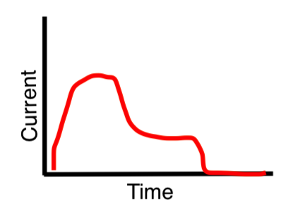

# Coffee-proclaimer

> Because coffee is great news!

A service to notify the office via Slack when a fresh pot of coffee is done! ☕️😎

The idea is to measure the current draw of the coffee maker. It shoud look
something like this for a typical brew:



While the brewer is boiling the water the current draw should be at it's peak.
After the water has been boiled there should still be some current draw for the
heated pad, at this plateau we know that there is fresh coffee in the pot. When
the current draw reaches zero again somebody (or a timer) has turned of the
heated pad, and there is no more (good) coffee to be had.

The first downward slope should trigger a "The coffee is done" message in the
coffee channel. The second downward slope should notify people that there is no
more coffee to be had, they missed their opportunity 😏

This is all implemented with a non-invasive current probed clamped around the
cable to the coffee maker. This is hooked up to a wifi-connected
microcontroller, which will post to the Slack API using webhooks. 


## Parts list

- Particle photon
- Non-invasive current probe (https://www.electrokit.com/produkt/stromprob-30a/)
- 3.5mm jack
- Resistor (357 ohms for a 2000 W coffee maker, calculations below)
- (Encasing)
- (Power supply)


## Math

The current probe measures up to 30 A, which yields a current of 15 mA. As an
example they provided that a 10 ohm resistor provides a measurable voltage of
5 mV/A. 

The microprocessor measures voltage from 0 to 3.3 v in 4096 steps. 

The moccamaster I googled runs on 1400 W, 13 A. 

Since U = R * I, their example becomes:

```
30 A in the big cable => 15 mA in the small cable
1 A in the big cable => 0.5 mA in the big cable
10 Ohm * 0.5 mA = 5 mV
```

which checks out 👌

For our use case, let's make sure we can tolerate 2000 W, 18.5 A, in
the big cable. This corresponds to 9.25 mA in the small cablle. The
calculations for the resistor value becomes:

```
R = U / I = 3300 mV / 9.25 mA ≈ 357 Ohms
```

## Future improvements

- By measuring the time spent in the "high current draw zone", we could
  calculate how many cups are being brewed. 
